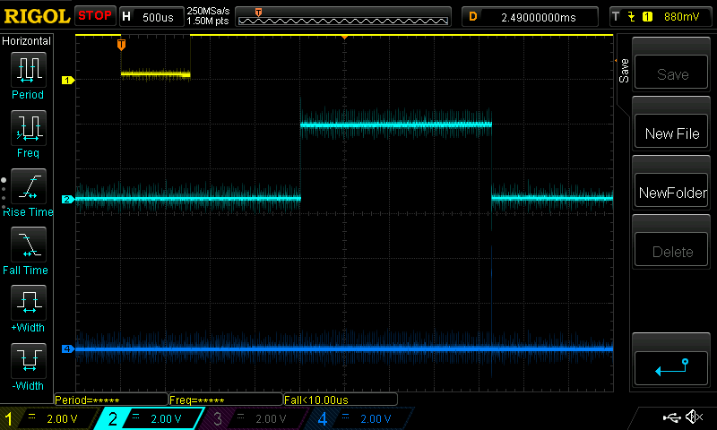
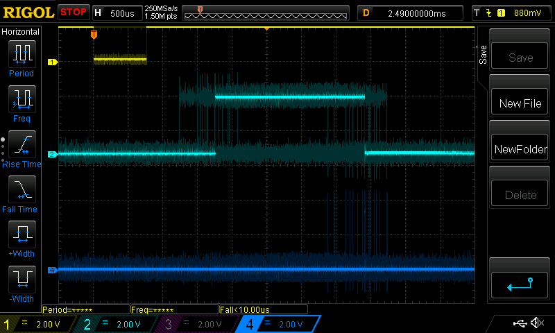

# Experimentation with a Raspberry Pi Pico and a 555 timer.

I wanted to work out how to reduce the power consumption of
a Raspberry Pi Pico. After reading a bit online I decided the
only way to tell what works is to try some experimentation.

## Starting Point

Take a Raspberry Pi Pico and connect a 555 timer to one of its
GPIOs. Arrange for the 555 to poke the Pico about 10 times a
second. Treat that "poke" as an interrupt. On the interrupt,
light the onboard LED, busy-wait for 1ms, then turn the LED
off again. This workload is representative of nothing in
particular, but it allows me to see that the Pico is running.

I added a series resistor into the power supply so I could
measure the power comsumption of the Pico. The resistor is
nominally 1ohm, which is the smallest I had. The meter says
it's actually 1.3ohm, so I'm not sure what it really is. But
I'll always use the exact same resistor for these tests so
let's call it representitive only.

Running with a bench PSU at 5.0V into the Pico's VSYS.

See Github project tag of "Starting Point".

### Starting Point Results

With the Pico running at its out of box configuration as per
the 'C' SDK, I see 23.9mV across the shunt resistor, which
indicates 18.38mA.

I turned the LED off by writing a 0 into the GPIO instead of
a 1, which leaves everything else the same. That gave me 23.7mV
across the resistor, so 18.23mA. Interesting start; the LED is
flickering away quite visibly in daylight, and consumes just
0.15mA. Bit of a digression, I don't care about the LED here,
but worth knowing.

I also have a Pico Probe programming device attached. Even though
it wasn't doing anything (or even powered via its own USB port)
with that attached the current draw went up about 5mA. Need to
remember to leave that disconnected.

## XOSC Status

I added a trivial printf to send to stdio the value of the
crystal oscillator status register:

```
  while(1)
  {
    printf("Status: %08X\n", xosc_hw->status);
    sleep_ms(1000);
  }
```

Somewhat oddly it comes out with ox81001001, which according to 
the Rp2040 datasheet is rather nonsensical. I put [a post](https://forums.raspberrypi.com/viewtopic.php?t=371238) on the
Raspberry Pi forum about this, and learned it's at least partially
covered by errata.

I've put it down to being a buggy part of the RP2040.

## Wake From Dormant 1

Next experiment was to try sending the RP2040 dormant and waking
it up from the external pulse delivered by the 555. The simplest
approach was just this:

```
  while(1)
  {
    gpio_set_dormant_irq_enabled( GPIO_PULSE_INPUT, GPIO_IRQ_EDGE_FALL, true );

    xosc_dormant();

    gpio_acknowledge_irq( GPIO_PULSE_INPUT, GPIO_IRQ_EDGE_FALL );
  }
```

This goes dormant, waiting to be woken by a falling edge on the
555-connected GPIO, then goes round and does it again.

I wasn't sure if the GPIO handler I had put in place would run in
this scenario, but it does (as you'd hope). Here's a trace:



Yellow is the 555 pulling the GPIO low to wake the rp2040. The Pico
wakes up and restores all services: the cyan line is set high at the
start of the GPIO handler, then low as that handler exits, so there's
a delay of about 1.25ms while the pico wakes up.

The dark blue line has a spike at the end of the GPIO handler. That's
the period in the main loop where the RP2040 sorts out the IRQs ready
to be woken again, and then goes back dormant. So the dark blue line
is low while the RP2040 is dormant and high while it's running.

Only that's not quite true. It turns out that the GPIO handler is
clearly being called as soon as the Pico is woken, and the next
instruction in the main loop (after "go dormant") is only executed
when the GPIO handler returns. That's why the dark blue line only goes
high after the cyan one goes low. The correct representation of the Pico
being awake would be for the dark blue line to go high at the same time
as the cyan one.

Also a bit odd is the length of the cyan period. The code is:

```
void gpios_callback( uint gpio, uint32_t events ) 
{
  /* Scope output follows the LED - high when this routine is running */
  gpio_put( GPIO_SCOPE_OUTPUT2, 1 );

  gpio_put(LED_PIN, FLICKER_LED);
  busy_wait_us_32(1000);
  gpio_put(LED_PIN, 0);

  gpio_put( GPIO_SCOPE_OUTPUT2, 0 );
}
```

so the cyan line is high for a busy wait of 1ms. Only the scope shows
it's high for over 2ms. What the trace doesn't show is that the cyan
line is dancing left to right all over the place. The timings are not
consistent. If I put the oscilloscpe persistence on 1sec, i see:



which shows the 555 is rock steady, but the pico waking up and doing
its thing is wandering by a ms or so. Thus you can't rely on the timings
of an RP2040 waking from dormant state.

The voltage across my sense resistor for this experiment was 1.6mV,
giving a current of 1.23mA. So making the RP2040 go dormant between
LED flickerings drops current draw to 6.7% of what it is when keeping
the RP2040 awake all the time. That's just the Pico, not the 555,
which now has to be added in. Based on the 555 datasheets, I'd expect
a CMOS 555 to draw about 180uA, but I don't have one to test.

But note that wake up period. Going dormant saves power, but you lose
time and consistency as the RP2040 wakes up rather erratically.

See Github project tag of "Dormant 1".

## Wake From Dormant 2

The next iteration was to try to restore everything back to working
order after the Pico comes back from dormancy. The previous example
comes back, but the clocks are all screwed up so basic stuff like
sleep_ms() doesn't work let alone things like USB.

More digging around the internet led me to examples which use code
from the sleep/hello_dormant example in the pico-playground project.
That's got a routine in it which shuts down the PLLs and sends
everything to sleep, and then shows how to recover and put it all back.
It's a fussy affair, needing things done in just the right order. If
you miss a trick it won't work. But the example here works for me.

At least, it works to a point. There's a thread [here](https://github.com/raspberrypi/pico-extras/issues/41)
from 2 years ago saying that the Pico doesn't always recover from the
dormancy. That appears to be the case. My loop runs, the 555 wakes the
Pico from dormancy 10 times a second, and everything is OK, until,
minutes or maybe hours later, it suddenly hangs up. There's no apparent
cause, and as of this writing no explanation or solution. There's
a post on there about the IRQ pool being exhausted and how unclaiming
one will prevent the problem. I tried it, and it just caused the Pico
to hang.

Also, the USB is typically messed up after the dormancy. There's no
solution to that. Someone posted to that thread saying how removing
the USB clock resetting from the clocks_init() function fixes it,
but I tried that and although the Pico didn't hang, the USB didn't
recover.

So I think this is as far as I can go with this. Something's buggy,
it's been reported, and it doesn't look like it's going to get
fixed.

The voltage across my sense resistor for this experiment was 1.1mV,
giving a current of 0.85mA. That will be the benefit of turning off
the PLLs while the RP2040 is dormant.